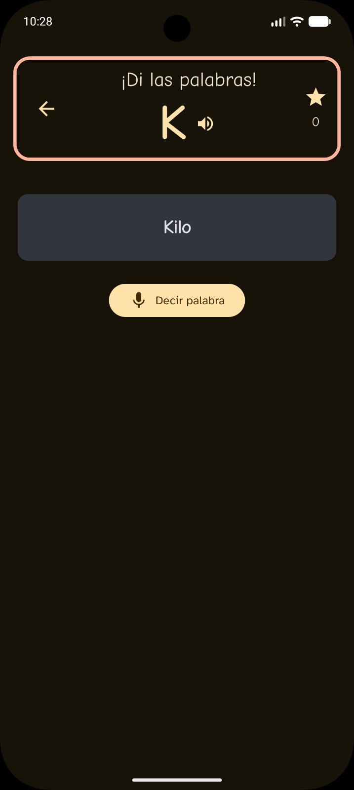
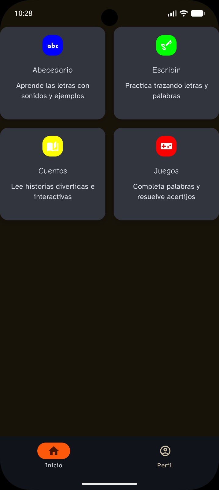
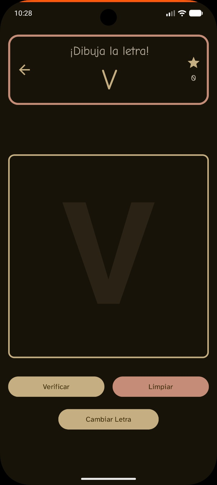
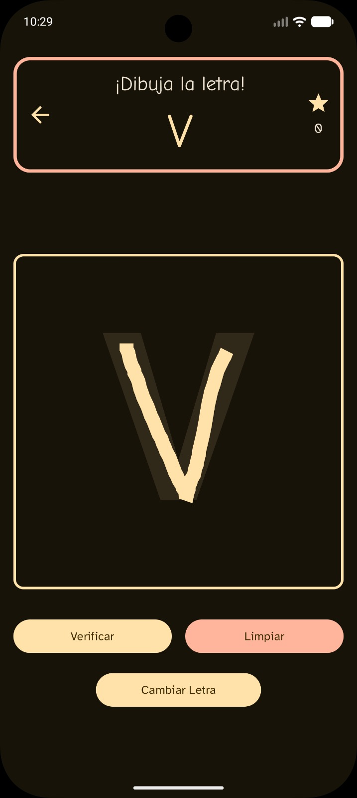

# Palabrin

### 🤝 Educational app for kids' literacy growth

 

---

## 📱 Screenshots

 

---

## 📖 Features

* **🎮 Gamified Literacy Learning**: Interactive educational games designed to keep young children engaged while learning to read.
* **🤖 Native Android App**: High-performance mobile experience built natively using Kotlin.
* **🗣️ Voice Narration Support**: Read-aloud storytelling and audio guidance to assist early readers.
* **🏆 Visual Rewards System**: Unlockable achievements and visual tokens to motivate progress and boost confidence.
* **📈 Progress Tracking**: Comprehensive monitoring to track children's reading level development.
* **🎨 Kid-Friendly UI/UX**: Colorful, intuitive, and accessible interface specifically tailored for toddlers and young learners.
* 🎨 **Modern UI with Jetpack Compose** — smooth, reactive, and visually consistent with Material 3.
* 🏗️ **Built to scale** — clean architecture ensures maintainability and future growth.

---

## ⬇️ Download

---

## 💬 Contact

For feedback, ideas, or issues:

- Open an issue on GitHub  
- Or contact the team directly  

---

## 👨‍💻 Contributors

<table>
<tr>

<td align="center">
<a href="https://github.com/BrandonFnts">

 

  <b>Brandon Fuentes</b>
  
Leader & Developer

</a>
</td>

<td align="center">
<a href="https://github.com/ReiLennux">

 

  <b>Lenny Monroy</b>
  
Developer & UX/UI

</a>
</td>

</tr>
</table>

---

## 🧱 Credits

- Firebase (Backend services)
- Google Maps SDK
- Material Design 3

